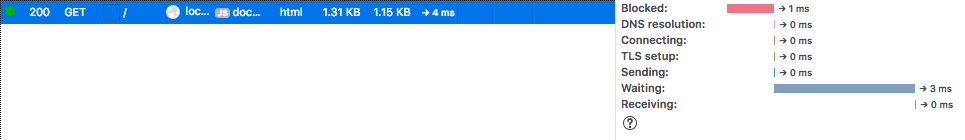

## Running the development server

    php vendor/bin/phalcon.php serve --basepath=../.htrouter.php

Now we can access the project via [http://localhost:8000/](http://localhost:8000/)

# build log

## Why use Phalcon?

Phalcon is not a framework you install via files inside your project, it's a PHP *extension* that provides framework functionality.



That's the index action of the bootstrapped *full-blown* framework, rendering in 3 milliseconds on a 2013 Macbook Air. *Without any tweaks*. The micro / api variants are even faster.

We could debate comparisons between Phalcon, Laravel, Symfony and others all day long, but the fact remains that this is ridiculously fast. I'll leave it to others to decide whether or not it's *better for them*. Instead of wasting time debating, I encourage you to try it out if you haven't yet. Let's dive right in.

## Setup
- Dependencies
    - PHP Version => 7.2.0RC6
    - [Phalcon Version => 3.2.0](https://docs.phalconphp.com/ja/3.2/installation)
- Create project dir
- Composer init
- Install composer dependencies (see composer.json)

### Using phalcon/devtools to create the project

    php vendor/bin/phalcon.php project [name] modules

Unfortunately, this creates a new nested directory (https://github.com/phalcon/phalcon-devtools/issues/1126), and the generated scaffolding is not up to the latest phalcon best practices (https://github.com/phalcon/phalcon-devtools/issues/1108)

It's still a good place to start, even if we need to make some modifications to the bootstrapped files:

### Post-bootstrap steps

**Move stuff out of the nested directory**

Simply move all of it, then delete the obsolete leftover created by phalcon devtools. The directory structure should look like this:

    ```
    .
    |-- app
    |   |-- bootstrap_cli.php
    |   |-- bootstrap_web.php
    |   |-- common
    |   |-- config
    |   `-- modules
    |-- cache
    |-- composer.json
    |-- composer.lock
    |-- public
    |   |-- css
    |   |-- files
    |   |-- img
    |   |-- index.html
    |   |-- index.php
    |   |-- js
    |   |-- temp
    |   |-- webtools.config.php
    |   `-- webtools.php
    |-- run
    `-- vendor
        |-- autoload.php
        |-- bin
        |-- ...
    ```

**Fix index.php**

Devtools has a built-in PHP server command, but it's not working out of the box.

Change the code of `index.php` to

    require __DIR__ . '/../app/bootstrap_web.php';

## Hello World

We can have use devtools to start the built-in PHP server for us:

    php vendor/bin/phalcon.php serve --basepath=../.htrouter.php

Now we can access the project via [http://localhost:8000/](http://localhost:8000/)


This is a good moment to put the project under git version control with a quick `git init` and

## todo
- [ ] catch notices
- [ ] error handling (500, 40x pages)
- [ ] db connection
- [ ] including composer autoloader
- [ ] set up nginx, cleanup .htaccess
